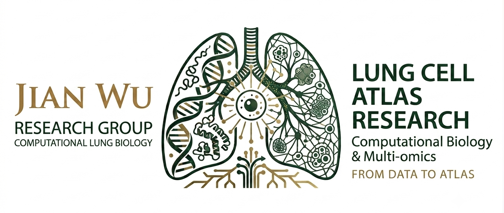

## 小节标题

这里开始写正文内容，支持标准 Markdown 语法。

### 代码块示例

```r
library(Seurat)
obj <- CreateSeuratObject(counts = mat)
obj <- NormalizeData(obj)
```

### 图片示例

如果需要插入图片，先把图片放到 `assets/img/tutorials/` 目录下，然后这样引用：



### 表格示例

| 参数 | 说明 |
|---|---|
| `min.cutoff` | 设置颜色映射下限 |
| `max.cutoff` | 设置颜色映射上限 |

### 列表示例

- 第一点
- 第二点
  - 子要点

正文可以随意写多个二级/三级标题、代码块、图片、表格、加粗 **重点内容**、行内代码 `like_this()`，Markdown 语法都会被正确渲染成 HTML。

